# 英文论文翻译器 - 工作流程图

## 系统架构流程图

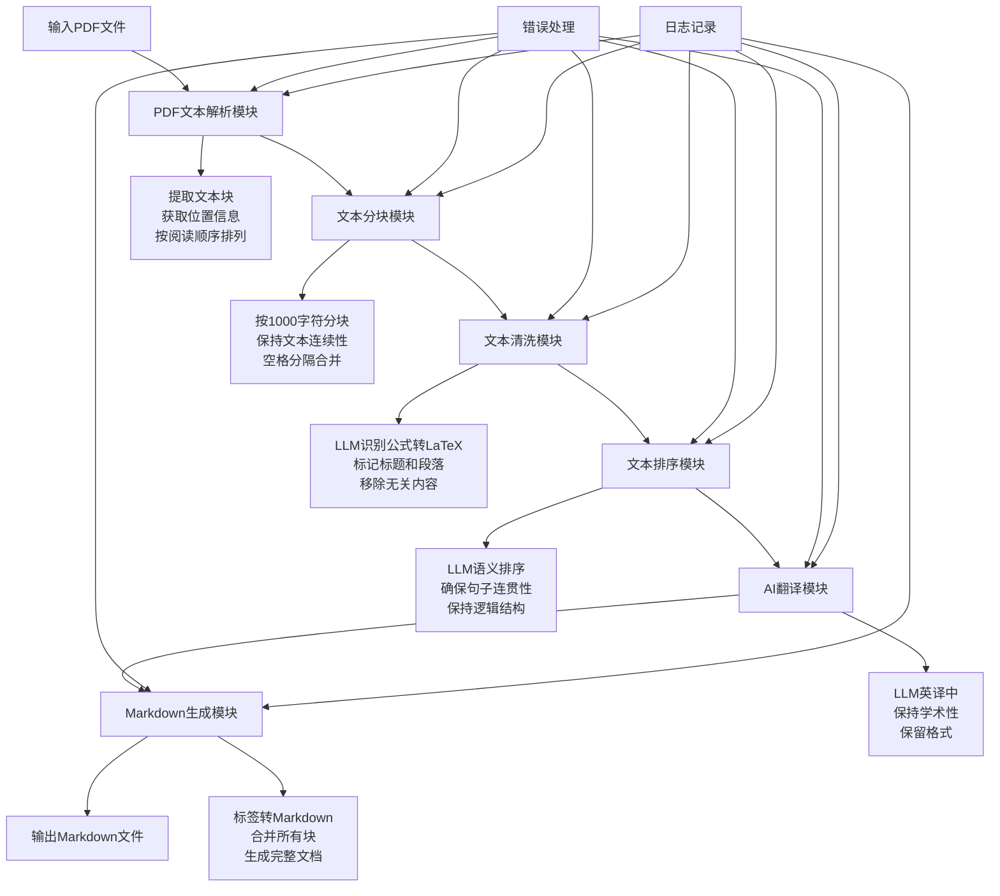

## 详细处理流程

### 阶段1: PDF文本解析
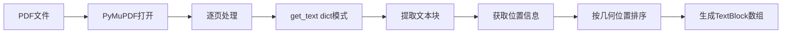

### 阶段2: 文本分块
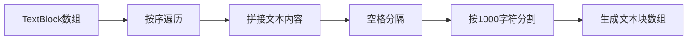

### 阶段3: 文本清洗
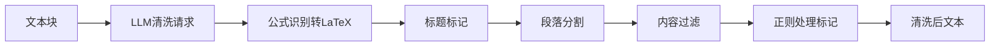

### 阶段4: 文本排序
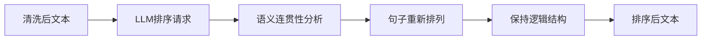

### 阶段5: AI翻译


### 阶段6: Markdown生成


## 数据流转

### TextBlock数据结构
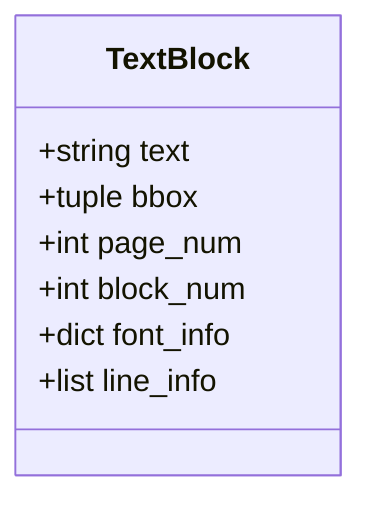

### 处理管道
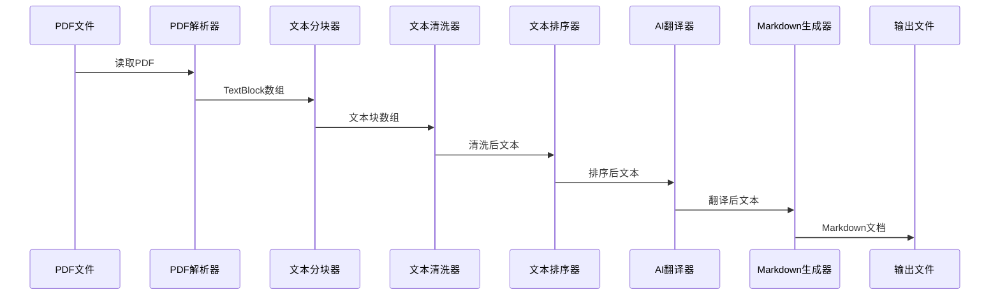

## 错误处理流程

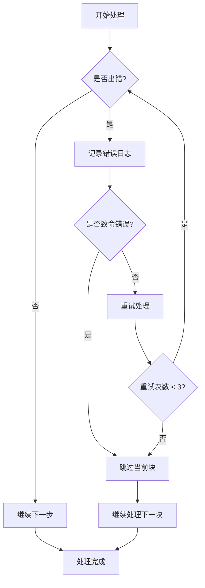

## 配置管理流程

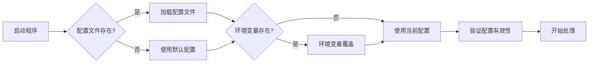

## 并发处理设计

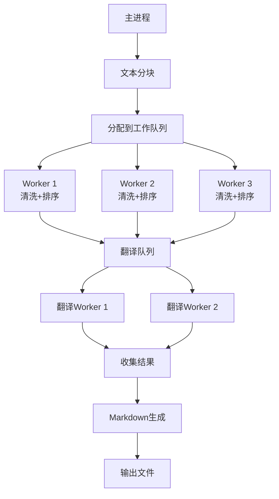

## 性能监控

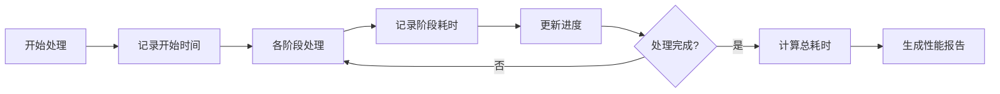

## 缓存机制

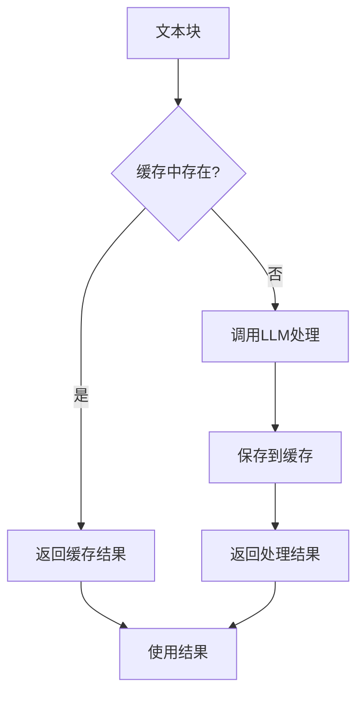

## 日志系统

```mermaid
graph LR
    A[各模块] --> B[生成日志事件]
    B --> C[日志过滤器]
    C --> D[格式化]
    D --> E[控制台输出]
    D --> F[文件输出]
    F --> G[日志轮转]